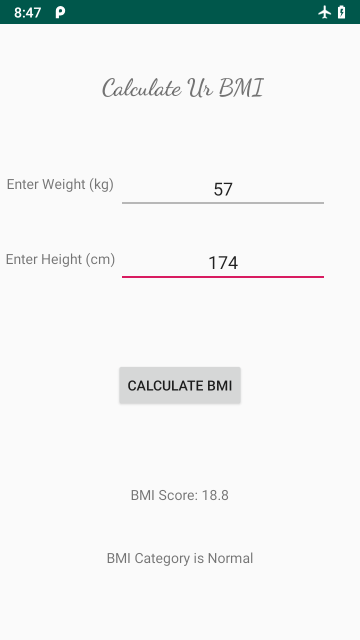

# UrBMI

## Description

[UrBMI](https://github.com/farisfebrianto/urbmi) is an Android Java app for calculating your Body Mass Index (BMI). No uses internet connection and very lightweight, tested on Android 9.0 Pie.

## Screenshot

